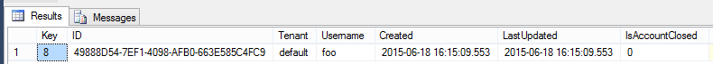

# IdentityServer3

Alright, we are back and looking at IdentityServer3. I assume you already know what it is and how it basically works. Also before we begin please read through this article in their documentation, as we will start with this:
http://identityserver.github.io/Documentation/docs/overview/mvcGettingStarted.html

And... we're back. So we are going to take our MembershipReboot code from last time and add a WebApi project to become our IdentityServer. Let's add it and reference the following NuGet packages:

