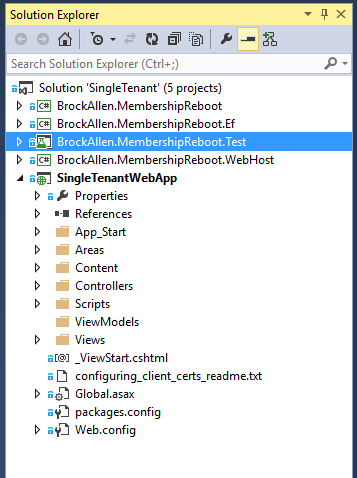
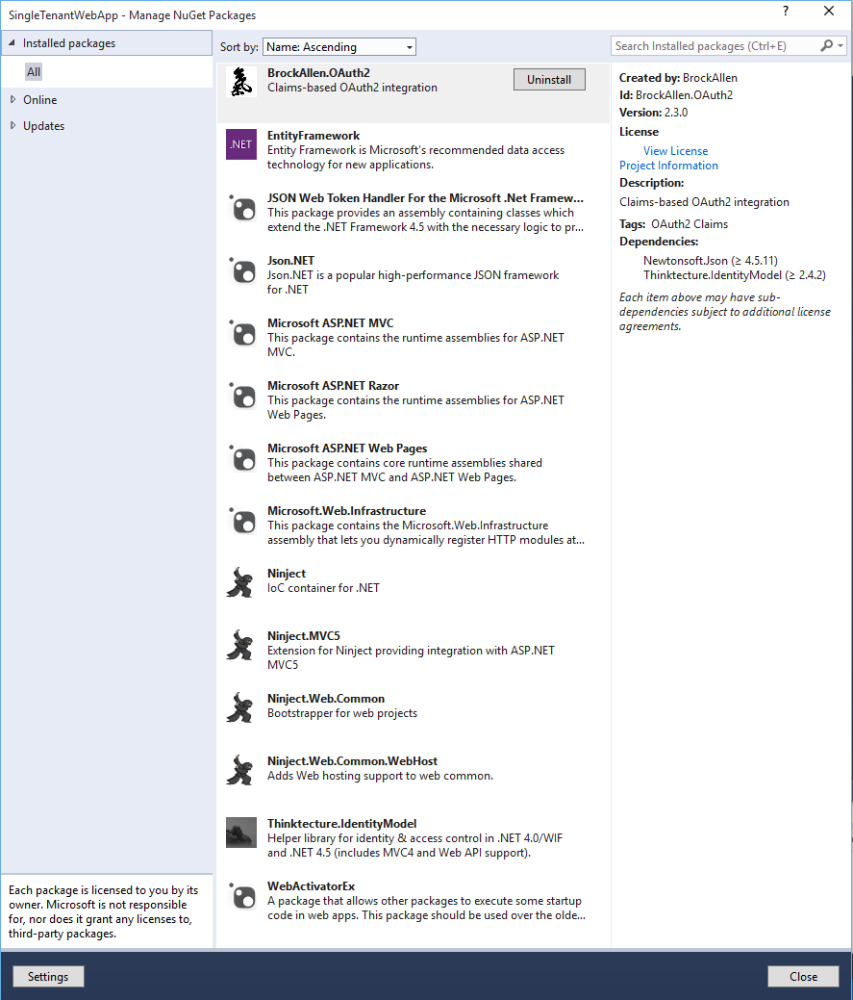

# Overview

Ok, so I have been having a lot of trouble understanding how MembershipReboot works. I feel like I understand how the whole OAuth2 workflow is supposed to wrok, but the configuration, setup, and sheer number of options in MembershipReboot are confusing to me. So here I am attempting to understand for myself and for others how all this works. So here we go.

## SingleTenant
I started by looking at the SingleTenant sample project to see what useful information I can glean. The very first thing you see are several projects:



It seems that the first 4 projects are part of the MembershipReboot infrastructure and can be ignored. So looking at the WebApp project there are several places that we can start looking. First of all I opened up Nuget to see what packages are in the project:

 

Important things to note:
* Ninject is not part of MembershipReboot, nor is it required.
* WebActivatorEx is simply to facilitate Ninject on startup

Now, RouteConfig.cs and FilterConfig.cs seem to be unchanged so we don't need to look at them. Opening NinjectWebCommon.cs we see a bunch of code that is specific to Ninject and can ignore. What is immediatly important is the last function, RegisterServices:

```csharp
private static void RegisterServices(IKernel kernel)
{
    Database.SetInitializer(new MigrateDatabaseToLatestVersion<DefaultMembershipRebootDatabase, BrockAllen.MembershipReboot.Ef.Migrations.Configuration>());

    var config = MembershipRebootConfig.Create();
    kernel.Bind<MembershipRebootConfiguration>().ToConstant(config);
    kernel.Bind<DefaultMembershipRebootDatabase>().ToSelf();
    kernel.Bind<UserAccountService>().ToSelf();
    kernel.Bind<AuthenticationService>().To<SamAuthenticationService>();
    kernel.Bind<IUserAccountQuery>().To<DefaultUserAccountRepository>().InRequestScope();
    kernel.Bind<IUserAccountRepository>().To<DefaultUserAccountRepository>().InRequestScope();
} 
```
For now let's ignore the database initializer and look at MembershipReboot. Right after the database initializer we see a line that call into another custom class `MembershipRebootConfig` which is supposed to create in instance of the `MembershipRebootConfiguration` class. Be careful of the naming similarities. 